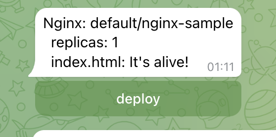

# Operator
В данной практике опробуем работу [operator-sdk][] на примере создания оператора на языке [GO][golang],
который позволяет производить деплой приложения с конфигурацией(для простоты возьмем nginx)
с запросом подтверждения операции.

## Operator-SDK

### Установка
Для работы потребуется утилита operator-sdk, установить ее можно используя
[инструкцию с официального сайта][install] или скачать со [страницы релизов на github][releases].
Для Windows рекомендуется использовать [WSL][] для работы с operator-sdk, так как она предполагает
наличие утилит командной строки, таких как `make`, `awk`, `sed`, `bash` и т.д.

### Инициализация
Создадим директорию для нового проекта и произведем инициализацию:
```console
$ mkdir operator && cd operator
$ operator-sdk init --domain miit.ru --repo github.com/yudolevich/kube-dev-course/example/operator
Writing kustomize manifests for you to edit...
Writing scaffold for you to edit...
Get controller runtime:
go get sigs.k8s.io/controller-runtime@v0.13.0
Update dependencies:
go mod tidy
Next: define a resource with:
operator-sdk create api
```
В команде `init` мы указываем произвольный домен, который будет использоваться в кастомных ресурсах,
а также имя репозитория, который будет использоваться в `go.mod`.

Также сгенерируем код для структур апи и контроллера:
```console
$ operator-sdk create api --group deploy --version v1alpha1 --kind Nginx --resource --controller
Writing kustomize manifests for you to edit...
Writing scaffold for you to edit...
api/v1alpha1/nginx_types.go
controllers/nginx_controller.go
Update dependencies:
go mod tidy
Running make:
make generate
Next: implement your new API and generate the manifests (e.g. CRDs,CRs) with:
make manifests
```

Таким образом мы инициализировали проект оператора, который будет обрабатывать ресурсы вида
`<kind>.<group>.<domain>`, то есть в нашем случае `nginxes.deploy.miit.ru`.

## GO
На данном этапе у нас есть каркас проекта оператора на golang, теперь необходимо описать нашу структуру
и логику ее обработки.

### Custom Types
Структура нашего кастомного ресурса находится в файле `api/v1alpha1/nginx_types.go`:
```go
// EDIT THIS FILE!  THIS IS SCAFFOLDING FOR YOU TO OWN!
// NOTE: json tags are required.  Any new fields you add must have json tags for the fields to be serialized.

// NginxSpec defines the desired state of Nginx
type NginxSpec struct {
        // INSERT ADDITIONAL SPEC FIELDS - desired state of cluster
        // Important: Run "make" to regenerate code after modifying this file

        // Foo is an example field of Nginx. Edit nginx_types.go to remove/update
        Foo string `json:"foo,omitempty"`
}

// NginxStatus defines the observed state of Nginx
type NginxStatus struct {
        // INSERT ADDITIONAL STATUS FIELD - define observed state of cluster
        // Important: Run "make" to regenerate code after modifying this file
}
```
Здесь нам сразу же предлагается отредактировать данную структуру, внеся необходимые нам поля,
а после запустить `make` для генерации кода. Добавим пару полей в `NginxSpec`: `Replicas` для задания
количества реплик в деплойменте и `Index` для указания текста, который должен выводить наш nginx.
Также в `NginxStatus` добавим индикатор подтверждения `Approved`, который будет сигнализировать о том,
что подтверждение получено:
```go
type NginxSpec struct {
        // INSERT ADDITIONAL SPEC FIELDS - desired state of cluster
        // Important: Run "make" to regenerate code after modifying this file

        Replicas int32  `json:"replicas,omitempty"`
        Index    string `json:"index"`
}

// NginxStatus defines the observed state of Nginx
type NginxStatus struct {
        // INSERT ADDITIONAL STATUS FIELD - define observed state of cluster
        // Important: Run "make" to regenerate code after modifying this file
        Approved bool `json:"approved"`
}
```
Также мы указываем json теги, которые будут использовать для сериализации нашей структуры в json формат,
который будет использоваться в нашем кастомном ресурсе при описании его в yaml формате.

После редактирования структуры для генерации необходимого кода и манифестов требуется запустить `make`:
```console
$ make generate
bin/controller-gen object:headerFile="hack/boilerplate.go.txt" paths="./..."
$ make manifests
bin/controller-gen rbac:roleName=manager-role crd webhook paths="./..." output:crd:artifacts:config=config/crd/bases
```

### Controllers
После инициализации operator-sdk создает директорию `controllers`, в которой генерирует код
контроллера `controllers/nginx_controller.go`, обрабатывающего наши кастомные ресурсы. Здесь создается
структура `NginxReconciler` и ее метод `Reconcile`, который будет вызываться при любых изменениях
нашего ресурса. Собственно ее нам сразу же и предлагается изменить:
```go
// Reconcile is part of the main kubernetes reconciliation loop which aims to
// move the current state of the cluster closer to the desired state.
// TODO(user): Modify the Reconcile function to compare the state specified by
// the Nginx object against the actual cluster state, and then
// perform operations to make the cluster state reflect the state specified by
// the user.
//
// For more details, check Reconcile and its Result here:
// - https://pkg.go.dev/sigs.k8s.io/controller-runtime@v0.13.0/pkg/reconcile
func (r *NginxReconciler) Reconcile(ctx context.Context, req ctrl.Request) (ctrl.Result, error) {
        _ = log.FromContext(ctx)

        // TODO(user): your logic here

        return ctrl.Result{}, nil
}
```

### Nginx controller
Добавим следующую логику: при получении обновления мы запрашиваем текущее состояние ресурса методом
`r.Get`, после чего проверяем поле `approved` в статусе ресурса и, если оно не проставлено,
то прекращаем обработку, иначе производим деплой.

```go
func (r *NginxReconciler) Reconcile(ctx context.Context, req ctrl.Request) (ctrl.Result, error) {
    logger := log.FromContext(ctx)
    nginx := &deployv1alpha1.Nginx{}
    if err := r.Get(ctx, req.NamespacedName, nginx); err != nil {
        if errors.IsNotFound(err) {
            return ctrl.Result{}, nil
        }

        return ctrl.Result{}, err
    }

    logger.WithValues("name", nginx.GetName(), "namespace", nginx.GetNamespace())

    logger.Info("reconicle")
    if !nginx.Status.Approved {
        // todo: send approve request
        return ctrl.Result{}, nil
    }

    if err := r.deploy(ctx, nginx); err != nil {
        logger.Error(err, "error deploy nginx")
        return ctrl.Result{}, nil
    }

    return ctrl.Result{}, nil
}
```

Сам процесс деплоя можно описать отдельно:
```go
func (r *NginxReconciler) deploy(ctx context.Context, nginx *deployv1alpha1.Nginx) error {
    labels := map[string]string{"nginx": nginx.GetName()}
    owner := metav1.OwnerReference{
        APIVersion: nginx.APIVersion,
        Kind:       nginx.Kind,
        UID:        nginx.GetUID(),
        Name:       nginx.GetName(),
    }

    cm := &v1.ConfigMap{
        ObjectMeta: metav1.ObjectMeta{
            Name:            nginx.GetName(),
            Namespace:       nginx.GetNamespace(),
            Labels:          labels,
            OwnerReferences: []metav1.OwnerReference{owner},
        },
        Data: map[string]string{
            "index.html": nginx.Spec.Index,
        },
    }

    deploy := &appsv1.Deployment{
        ObjectMeta: metav1.ObjectMeta{
            Name:            nginx.GetName(),
            Namespace:       nginx.GetNamespace(),
            OwnerReferences: []metav1.OwnerReference{owner},
        },
        Spec: appsv1.DeploymentSpec{
            Selector: &metav1.LabelSelector{MatchLabels: labels},
            Replicas: &nginx.Spec.Replicas,
            Template: v1.PodTemplateSpec{
                ObjectMeta: metav1.ObjectMeta{Labels: labels},
                Spec: v1.PodSpec{
                    Containers: []v1.Container{
                        {
                            Name:  "nginx",
                            Image: "nginx",
                            VolumeMounts: []v1.VolumeMount{
                                {
                                    Name:      "index",
                                    MountPath: "/usr/share/nginx/html",
                                },
                            },
                        },
                    },
                    Volumes: []v1.Volume{
                        {
                            Name: "index",
                            VolumeSource: v1.VolumeSource{
                                ConfigMap: &v1.ConfigMapVolumeSource{
                                    LocalObjectReference: v1.LocalObjectReference{
                                        Name: nginx.GetName(),
                                    },
                                },
                            },
                        },
                    },
                },
            },
        },
    }

    if err := r.apply(ctx, cm); err != nil {
        return err
    }

    if err := r.apply(ctx, deploy); err != nil {
        return err
    }

    return nil
}

func (r *NginxReconciler) apply(ctx context.Context, obj client.Object) error {
    logger := log.FromContext(ctx)

    if err := r.Get(ctx, client.ObjectKeyFromObject(obj), obj); err != nil {
        if !errors.IsNotFound(err) {
            return err
        }

        logger.Info("create")
        if err := r.Create(ctx, obj); err != nil {
            return err
        }

        return nil
    }

    logger.Info("update")
    if err := r.Update(ctx, obj); err != nil {
        return err
    }

    return nil
}

```
Здесь мы описываем структуры Deployment и ConfigMap также как мы это делали в yaml формате, но с
использованием golang, что дает нам дополнительную гибкость за счет возможностей полнофункционального
языка и удобство за счет работы в IDE или продвинутом текстовом редакторе с возможностью автодополнения
и подсвечивания ошибок. Как видно мы взяли параметры из нашего ресурса `nginx`, так что `replicas`
попало в Deployment, а `index` в ConfigMap, который монтируется в него. Также мы использовали поле
`OwnerReference`, таким образом при удалении нашего кастомного ресурса `nginx` также каскадно удалятся
все его дочерние ресурсы.

Осталось только описать логику для подтверждения деплоя.

### Telegram
Для подтверждения деплоя предлагаю создать контроллер, который будет писать вам в [telegram][] при
появлении нового ресурса `nginx`. Чтобы создать нового бота достаточно написать
[t.me/botfather](https://t.me/botfather) команду `/newbot`, он спросит вас имя и уникальный username
для бота и выдаст ссылку на него и токен, которым мы сможем воспользоваться в нашем операторе.

Также нам понадобится `chat_id` для отправки сообщений, для этого достаточно перейти в диалог с ботом
и нажать `start`, после чего выполнить в терминале:
```console
$ token=<токен бота>
$ curl https://api.telegram.org/bot${token}/getUpdates
```
После чего вы получите json с сообщением `/start`, в котором в поле `id` будет указан идентификатор
диалога с ботом, которым мы и воспользуемся далее вместе с токеном.

### Telegram controller
Для взаимодействия с [telegram][] можно воспользоваться пакетом [go-telegram-bot-api][go-telegram],
выполним команду `go get`:
```console
$ go get -u github.com/go-telegram-bot-api/telegram-bot-api/v5
```

И создадим файл `controllers/telegram_controller.go`, в котором опишем структуру контроллера, функцию
создания нового контроллера и логику получения обновлений о новых сообщениях и проставление в статусе
нашего кастомного ресурса `nginx` поля `approved:true`. Также сделаем метод `SendDeploy`, который
будет отправляет сообщение о появлении нашего ресурса `nginx` в кластере.

```{warning}
Данный код не предназначен для продуктивного использования и нужен лишь в целях обучения работы
с operator-sdk.
```

```go
package controllers

import (
    "context"
    "fmt"
    "strings"

    tgbotapi "github.com/go-telegram-bot-api/telegram-bot-api/v5"
    "github.com/yudolevich/kube-dev-course/example/operator/api/v1alpha1"
    v1 "k8s.io/apimachinery/pkg/apis/meta/v1"
    "k8s.io/apimachinery/pkg/types"
    "sigs.k8s.io/controller-runtime/pkg/client"
)

type TBot struct {
    *tgbotapi.BotAPI
    kube client.Client
    uid  int64
}

func NewTBot(token string, uid int64, client client.Client) (*TBot, error) {
    bot, err := tgbotapi.NewBotAPI(token)
    if err != nil {
        return nil, err
    }

    return &TBot{BotAPI: bot, uid: uid, kube: client}, nil
}

func (b *TBot) Start(ctx context.Context) error {
    for update := range b.GetUpdatesChan(tgbotapi.NewUpdate(0)) {
        if update.CallbackQuery == nil {
            continue
        }

        name := strings.Split(update.CallbackQuery.Data, "/")
        if len(name) != 2 {
            continue
        }

        b.kube.Status().Patch(ctx, &v1alpha1.Nginx{
            ObjectMeta: v1.ObjectMeta{Name: name[1], Namespace: name[0]},
        }, client.RawPatch(types.MergePatchType, []byte(`{"status":{"approved": true}}`)),
        )
    }

    return nil
}

func (b *TBot) SendDeploy(nginx *v1alpha1.Nginx) {
    msg := tgbotapi.NewMessage(
        b.uid,
        fmt.Sprintf(`Nginx: %s/%s
        replicas: %d
        index.html: %s`,
            nginx.GetNamespace(), nginx.GetName(),
            nginx.Spec.Replicas, nginx.Spec.Index),
    )
    msg.ReplyMarkup = tgbotapi.NewInlineKeyboardMarkup(
        tgbotapi.NewInlineKeyboardRow(
            tgbotapi.NewInlineKeyboardButtonData(
                "deploy",
                fmt.Sprintf("%s/%s", nginx.GetNamespace(), nginx.GetName()),
            ),
        ),
    )

    b.Send(msg)
}
```

Теперь добавим в `nginx_controller.go` отправку сообщения в [telegram][] там где мы оставили `todo`
комментарий, также расширив структуру нашего `NginxReconciler`:
```go
// NginxReconciler reconciles a Nginx object
type NginxReconciler struct {
    client.Client
    Tbot   *TBot
    Scheme *runtime.Scheme
}
...
    logger.Info("reconicle")
    if !nginx.Status.Approved {
        r.Tbot.SendDeploy(nginx)
        return ctrl.Result{}, nil
    }
```

Осталось лишь дописать инициализацию нашего приложения в `main.go`, для этого
добавим в него создание `TBot` контроллера и добавление его в `Manager` и `NginxReconciler`:
```go
    chatid, err := strconv.ParseInt(os.Getenv("TELEGRAM_CHATID"), 10, 64)
    if err != nil {
        setupLog.Error(err, "error parse chatid")
        os.Exit(1)
    }

    tbot, err := controllers.NewTBot(os.Getenv("TELEGRAM_APITOKEN"), chatid, mgr.GetClient())
    if err != nil {
        setupLog.Error(err, "unable to create telegram bot controller")
        os.Exit(1)
    }

    if err = (&controllers.NginxReconciler{
        Client: mgr.GetClient(),
        Scheme: mgr.GetScheme(),
        Tbot:   tbot,
    }).SetupWithManager(mgr); err != nil {
        setupLog.Error(err, "unable to create controller", "controller", "Nginx")
        os.Exit(1)
    }
    //+kubebuilder:scaffold:builder

    if err := mgr.Add(tbot); err != nil {
        setupLog.Error(err, "unable to add telegram bot controller to manager")
        os.Exit(1)
    }
```

## Build & Deploy
На всякий случай повторим генерацию кода и манифестов, а также сделаем проверку зависимостей и
запустим сборку:
```console
$ make generate
bin/controller-gen object:headerFile="hack/boilerplate.go.txt" paths="./..."
$ make manifests
bin/controller-gen rbac:roleName=manager-role crd webhook paths="./..." output:crd:artifacts:config=config/crd/bases
$ go mod tidy
$ make docker-build
...
Step 16/16 : ENTRYPOINT ["/manager"]
 ---> Running in a396e3faa2fa
Removing intermediate container a396e3faa2fa
 ---> 22229db80f19
Successfully built 22229db80f19
Successfully tagged controller:latest
```

Перед деплоем необходимо внести пару изменений в манифесты, так как мы используем переменные среды и
также запретим загрузку образа из внешних источников, для этого приведем файл
`config/default/manager_config_patch.yaml` к следующему виду:
```yaml
apiVersion: apps/v1
kind: Deployment
metadata:
  name: controller-manager
  namespace: system
spec:
  template:
    spec:
      containers:
      - name: manager
        imagePullPolicy: Never
        env:
        - name: "TELEGRAM_CHATID"
          value: "<chat id>"
        - name: "TELEGRAM_APITOKEN"
          value: "<bot token>"
```
Указав свои `chat id` и `bot token`, и добавим строку в файл `config/default/kustomization.yaml` в блок
`patchesStrategicMerge`, приведя его к виду:
```yaml
patchesStrategicMerge:
# Protect the /metrics endpoint by putting it behind auth.
# If you want your controller-manager to expose the /metrics
# endpoint w/o any authn/z, please comment the following line.
- manager_auth_proxy_patch.yaml
- manager_config_patch.yaml
```

Также необходимы права на взаимодействие с ресурсами Deployment и ConfigMap нашему оператору, для
этого создадим кластерную роль и биндинг `config/rbac/role-deploy.yaml`:
```yaml
---
apiVersion: rbac.authorization.k8s.io/v1
kind: ClusterRole
metadata:
  creationTimestamp: null
  name: manager-role-deploy
rules:
- apiGroups:
  - ""
  resources:
  - configmaps
  verbs:
  - create
  - delete
  - get
  - list
  - patch
  - update
  - watch
- apiGroups:
  - apps
  resources:
  - deployments
  verbs:
  - create
  - delete
  - get
  - list
  - patch
  - update
  - watch
---
apiVersion: rbac.authorization.k8s.io/v1
kind: ClusterRoleBinding
metadata:
  name: manager-rolebinding-deploy
roleRef:
  apiGroup: rbac.authorization.k8s.io
  kind: ClusterRole
  name: manager-role-deploy
subjects:
- kind: ServiceAccount
  name: controller-manager
  namespace: system
```

Также необходимо указать этот файл в `config/rbac/kustomization.yaml`:
```yaml
- service_account.yaml
- role.yaml
- role_binding.yaml
- leader_election_role.yaml
- leader_election_role_binding.yaml
- auth_proxy_service.yaml
- auth_proxy_role.yaml
- auth_proxy_role_binding.yaml
- auth_proxy_client_clusterrole.yaml
- role-deploy.yaml
```

Осталось лишь загрузить образ в кластер и выполнить деплой:
```console
$ kind load docker-image controller
Image: "" with ID "sha256:22229db80f19bba9f657e7095bc8da00b10b8d221b4ba7e60e83dafe0c087f9c" not yet present on node "kind-control-plane", loading...
$ make deploy
namespace/operator-system created
customresourcedefinition.apiextensions.k8s.io/nginxes.deploy.miit.ru created
serviceaccount/operator-controller-manager created
role.rbac.authorization.k8s.io/operator-leader-election-role created
clusterrole.rbac.authorization.k8s.io/operator-manager-role created
clusterrole.rbac.authorization.k8s.io/operator-manager-role-deploy created
clusterrole.rbac.authorization.k8s.io/operator-metrics-reader created
clusterrole.rbac.authorization.k8s.io/operator-proxy-role created
rolebinding.rbac.authorization.k8s.io/operator-leader-election-rolebinding created
clusterrolebinding.rbac.authorization.k8s.io/operator-manager-rolebinding created
clusterrolebinding.rbac.authorization.k8s.io/operator-manager-rolebinding-deploy created
clusterrolebinding.rbac.authorization.k8s.io/operator-proxy-rolebinding created
service/operator-controller-manager-metrics-service created
deployment.apps/operator-controller-manager created
$ kubectl get po -n operator-system
NAME                                           READY   STATUS    RESTARTS   AGE
operator-controller-manager-6798bdbdbd-n2cqt   2/2     Running   0          5m50s
```

## Run
Создадим наш кастомный ресурс типа `nginxes.deploy.miit.ru`:
```bash
$ kubectl create -f - <<EOF
apiVersion: deploy.miit.ru/v1alpha1
kind: Nginx
metadata:
  labels:
  name: nginx-sample
spec:
  replicas: 1
  index: |
    It's alive!
EOF
nginx.deploy.miit.ru/nginx-sample created
```
После чего оператор должен отправить вам сообщение:


Если на текущий момент посмотреть в проекте, то никаких подов создано не будет:
```console
$ kubectl get po
No resources found in default namespace.
```

После же нажатия на кнопку `deploy` в сообщении - оператор подтвердит создание ресурсов в кластере и
под будет создан, при запросе к нему можно убедиться, что значение `index.html` взято из нашего ресурса:
```console
$ kubectl get po
NAME                            READY   STATUS    RESTARTS   AGE
nginx-sample-6b79c55d84-j6j62   1/1     Running   0          4s

$ kubectl get --raw /api/v1/namespaces/default/pods/$(k get po -o name | cut -d/ -f2)/proxy
It's alive!
```

После удаления нашего ресурса `nginx` также каскадно удалятся Deploy, Pod и ConfigMap:
```console
$ kubectl delete nginx nginx-sample
nginx.deploy.miit.ru "nginx-sample" deleted
$ kubectl get po
No resources found in default namespace.
```

Пример кода из данной практики можно посмотреть [по ссылке][github].


[operator-sdk]:https://sdk.operatorframework.io/
[golang]:https://go.dev/
[install]:https://sdk.operatorframework.io/docs/installation/
[releases]:https://github.com/operator-framework/operator-sdk/releases
[wsl]:https://learn.microsoft.com/ru-ru/windows/wsl/
[telegram]:https://telegram.org/
[go-telegram]:https://go-telegram-bot-api.dev
[github]:https://github.com/yudolevich/kube-dev-course/tree/main/examples/operator
