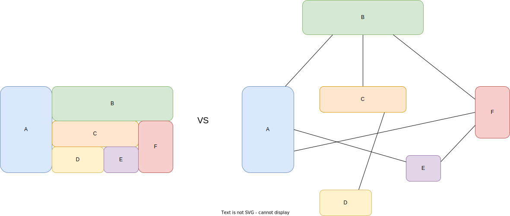

## Основные концепции

```{image} img/control-plane.svg
:width: 200px
```

### Эволюция инфраструктуры


###
Физические сервера


###
Физические сервера

Минусы
```{revealjs-fragments}
* борьба приложений за ресурсы
* проблема вертикального масштабирования
* неэффективное использование ресурсов
```

###
Виртуализация


###
Виртуализация
```{revealjs-fragments}
* ресурсы ограничены параметрами виртуальной машины
* простота вертикального масштабирования
* возможность более плотного размещения
```

###
Контейнеры


```{revealjs-fragments}
Зачем?
```

###
Отличие контейнеров от ВМ

```{revealjs-fragments}
* изоляция на уровне ОС
* запускается только нужное приложение
* минимальные накладные расходы
```

###
DevOps практики
```{revealjs-fragments}
* гибкость создания и развертывания с docker image
* одинаково работает при разработке, тестировании и на проде
* удобство использования в CI/CD
* хорошо подходит для микросервисной архитектуры
```

### Эволюция архитектуры приложений


###
Монолитная архитектура


###
Монолитная архитектура
```{revealjs-fragments}
* изменения одного компонента требуют редеплой всего приложения
* требуются мощные сервера, проблема масштабирования
* нельзя масштабировать только нужные компоненты
* отказ одного компонента ведет к полной неработоспособности
* сложная структура проекта, тяжело заменять компоненты
```

###
Микросервисная архитектура


###
Микросервисная архитектура
```{revealjs-fragments}
* можно обновлять независимо
* меньше требования к ресурсам, легко масштабировать горизонтально
* можно масштабировать только необходимые компоненты
* при отказе затрагивает только связанные компоненты
* разработка на разных языках и технологиях
```

### Kubernetes
```{image} img/logo.svg
:width: 100px
```
```{revealjs-fragments}
* размещение и жизненный цикл контейнеров
* масштабирование и распределение нагрузки
* конфигурация через декларативное описание
```

###
Основные компоненты
```{revealjs-fragments}
* control-plane 
* node components 
```

### Control Plane

```{revealjs-fragments}
* обработка операций взаимодействия с кластером
* управления размещением нагрузки по нодам
* отслеживание ресурсов и событий в кластере и их обработка
```

### Control Plane
```{revealjs-fragments}
* kube-apiserver 
* etcd 
```

### Control Plane
```{revealjs-fragments}
* kube-scheduler 
* kube-controller-manager 
* cloud-controller-manager 
```

###
Отказоустойчивый кластер


### Node

```{revealjs-fragments}
* kubelet 
* kube-proxy 
* container runtime 
```

### API Kubernetes


###
Объект в kubernetes
```{revealjs-fragments}
* Конфигурация и состояние нод кластера(Node)
* Конфигурация и состояние развертывания приложения(Deployment)
* Конфигурация данных для приложения(ConfigMap)
```

###
Объект в kubernetes
```{revealjs-code-block} yaml
---
data-line-numbers: 1|2|3-7|8-14|15
---
apiVersion: v1
kind: Pod
metadata:
  creationTimestamp: null
  labels:
    run: nginx
  name: nginx
spec:
  containers:
  - image: nginx
    name: nginx
    resources: {}
  dnsPolicy: ClusterFirst
  restartPolicy: Always
status: {}
```

###
REST
```bash
$ kubectl get --raw /
{
  "paths": [
    "/.well-known/openid-configuration",
    "/api",
    "/api/v1",
    "/apis",
    "/apis/",
    "/apis/apps",
    "/apis/apps/v1",
    ...
```

###
Groups
```{revealjs-fragments}
* /api/v1 - core группа, соответствует\
  apiVersion: v1
* /apis/$GROUP/$VERSION - именованные группы, соответствует\
  apiVersion: $GROUP/$VERSION
```

###
Scope
```{revealjs-code-block} bash
---
data-line-numbers: 1-3|5-7
---
# для cluster-wide ресурсов
"/apis/${GROUP}/${VERSION}/${RESOURCE}"
(/apis/apiregistration.k8s.io/v1/apiservices)

# для namespaced ресурсов
"/apis/${GROUP}/${VERSION}/namespaces/${NAMESPACE}/${RESOURCE}"
(/apis/apps/v1/namespaces/default/deployments)
```

###
Get Object
```{revealjs-code-block} bash
"/apis/$GROUP/$VERSION/namespaces/$NAMESPACE/$RESOURCE/$NAME"
```
