## Network/LoadBalance

```{image} img/svc.svg
:width: 200px
```

### Networks

```{revealjs-fragments}
* Node network
* Pod network
* Service network
```

### Concepts

```{revealjs-fragments}
* Service
* Ingress
* Network Policy
* DNS
```

### Service

```{revealjs-code-block} yaml
---
data-line-numbers: 1-2|8-9|10|11|12|13|14|15
---
apiVersion: v1
kind: Service
metadata:
  labels:
    app: nginx
  name: nginx
spec:
  selector:
    app: nginx
  ports:
  - name: web
    port: 80
    protocol: TCP
    targetPort: 8080
  type: ClusterIP
```

### Service types

```{revealjs-fragments}
* ClusterIP
* NodePort
* LoadBalancer
* ExternalName
```

### Service expose

```{revealjs-code-block} console
---
data-line-numbers: 1|2-15
---
$ k expose deploy nginx-deployment --port 80 --dry-run=client -o yaml
apiVersion: v1
kind: Service
metadata:
  creationTimestamp: null
  labels:
    app: nginx
  name: nginx-deployment
spec:
  ports:
  - port: 80
    protocol: TCP
    targetPort: 80
  selector:
    app: nginx
```

### Endpoints

```{revealjs-code-block} yaml
---
data-line-numbers: 1-2|8-9|10|11|12-16|31-34
---
apiVersion: v1
kind: Endpoints
metadata:
  labels:
    app: nginx
  name: nginx
  namespace: default
subsets:
- addresses:
  - ip: 10.244.1.5
    nodeName: kind-worker2
    targetRef:
      kind: Pod
      name: nginx-deployment-76d6c9b8c-n6c4f
      namespace: default
      uid: 7ec844ca-36d9-4082-a7ea-e0cd8e95d390
  - ip: 10.244.2.25
    nodeName: kind-worker
    targetRef:
      kind: Pod
      name: nginx-deployment-76d6c9b8c-9h2fn
      namespace: default
      uid: a93b7fd4-43b1-4c85-897b-3d150a8ec3dd
  - ip: 10.244.2.26
    nodeName: kind-worker
    targetRef:
      kind: Pod
      name: nginx-deployment-76d6c9b8c-r9vll
      namespace: default
      uid: d31680a6-1aad-439c-84a2-aee8c5d1930e
  ports:
  - name: web
    port: 8080
    protocol: TCP
```

### Ingress



### Ingress



### Ingress



### Ingress Spec

```{revealjs-fragments}
* rules
* ingressClassName
* tls
* defaultBackend
```

### Ingress

```{revealjs-code-block} yaml
---
data-line-numbers: 1-2|6|7|8-11|12-16|17-26
---
apiVersion: networking.k8s.io/v1
kind: Ingress
metadata:
  name: example-ingress
spec:
  rules:
  - host: app.example.com
    http:
      paths:
      - path: /
        pathType: Prefix
        backend:
          service:
            name: frontend
            port:
              name: http
  - host: api.example.com
    http:
      paths:
      - path: /api
        pathType: Prefix
        backend:
          service:
            name: backend
            port:
              name: http
```

### Ingress create

```{revealjs-code-block} console
---
data-line-numbers: 1|2-18
---
$ k create ingress test --rule 'example.com/*=svc:8080' --dry-run=client -o yaml
apiVersion: networking.k8s.io/v1
kind: Ingress
metadata:
  creationTimestamp: null
  name: test
spec:
  rules:
  - host: example.com
    http:
      paths:
      - backend:
          service:
            name: svc
            port:
              number: 8080
        path: /
        pathType: Prefix
```

### Network Policies

```{revealjs-fragments}
Entities
* Pods
* Namespaces
* IP Blocks
```

### Network Policies

```{revealjs-code-block} yaml
---
data-line-numbers: 1-2|7-9|10-12|13|15-18|19-21|22-24|25-27|28|29-34
---
apiVersion: networking.k8s.io/v1
kind: NetworkPolicy
metadata:
  name: netpol
  namespace: default
spec:
  podSelector:
    matchLabels:
      role: db
  policyTypes:
    - Ingress
    - Egress
  ingress:
    - from:
        - ipBlock:
            cidr: 172.17.0.0/16
            except:
              - 172.17.1.0/24
        - namespaceSelector:
            matchLabels:
              project: myproject
        - podSelector:
            matchLabels:
              role: frontend
      ports:
        - protocol: TCP
          port: 6379
  egress:
    - to:
        - ipBlock:
            cidr: 10.0.0.0/24
      ports:
        - protocol: TCP
          port: 5978
```

### DNS

```{revealjs-fragments}
Service:
* svc-name.namespace.svc.cluster.local

Pod:
* pod-ip.namespace.pod.cluster.local
* pod-ip.svcname.namespace.svc.cluster.local
```

### Use Cases

### Rolling Update

```{image} img/rollingupdate1.svg
:width: 500px
```

### Rolling Update

```{image} img/rollingupdate2.svg
:width: 500px
```

### Rolling Update

```{image} img/rollingupdate3.svg
:width: 500px
```

### Rolling Update

```{image} img/rollingupdate4.svg
:width: 500px
```

### Blue/Green Deploy

```{image} img/bluegreen1.svg
:width: 500px
```

### Blue/Green Deploy

```{image} img/bluegreen2.svg
:width: 500px
```

### Blue/Green Deploy

```{image} img/bluegreen3.svg
:width: 500px
```

### Blue/Green Deploy

```{image} img/bluegreen4.svg
:width: 500px
```

### Blue/Green Deploy

```{revealjs-code-block} console
---
data-line-numbers: 1-20|13-20|23-27|30-44|42-43|47-52|54-73|66-73|76-83|84-89|91-92|93-98|100-101
---
$ k apply -f - << EOF
apiVersion: apps/v1
kind: Deployment
metadata:
  name: nginx-v1
  labels:
    app: nginx-v1
spec:
  replicas: 3
  selector:
    matchLabels:
      app: nginx-v1
  template:
    metadata:
      labels:
        app: nginx-v1
    spec:
      containers:
      - name: nginx
        image: nginx
EOF
deployment.apps/nginx-v1 created
$ k get po
NAME                        READY   STATUS    RESTARTS   AGE
nginx-v1-6c5f795c6f-794rl   1/1     Running   0          11s
nginx-v1-6c5f795c6f-9g596   1/1     Running   0          11s
nginx-v1-6c5f795c6f-zbrnp   1/1     Running   0          11s

$ k apply -f - << EOF
apiVersion: v1
kind: Service
metadata:
  labels:
    app: nginx
  name: nginx
spec:
  ports:
  - name: http
    port: 80
    protocol: TCP
    targetPort: 80
  selector:
    app: nginx-v1
  type: ClusterIP
EOF
service/nginx created
$ k get svc nginx
NAME    TYPE        CLUSTER-IP      EXTERNAL-IP   PORT(S)   AGE
nginx   ClusterIP   10.96.148.240   <none>        80/TCP    6s
$ k get ep nginx
NAME    ENDPOINTS                                      AGE
nginx   10.244.1.53:80,10.244.2.18:80,10.244.2.19:80   10s

$ k apply -f - << EOF
apiVersion: apps/v1
kind: Deployment
metadata:
  name: nginx-v2
  labels:
    app: nginx-v2
spec:
  replicas: 3
  selector:
    matchLabels:
      app: nginx-v2
  template:
    metadata:
      labels:
        app: nginx-v2
    spec:
      containers:
      - name: nginx
        image: nginx:1.23
EOF
deployment.apps/nginx-v2 created
$ k get po
NAME                        READY   STATUS    RESTARTS   AGE
nginx-v1-6c5f795c6f-794rl   1/1     Running   0          2m42s
nginx-v1-6c5f795c6f-9g596   1/1     Running   0          2m42s
nginx-v1-6c5f795c6f-zbrnp   1/1     Running   0          2m42s
nginx-v2-7dcd48768d-5rmrn   1/1     Running   0          29s
nginx-v2-7dcd48768d-c5zps   1/1     Running   0          29s
nginx-v2-7dcd48768d-gphlv   1/1     Running   0          29s
$ k get svc,ep nginx
NAME            TYPE        CLUSTER-IP      EXTERNAL-IP   PORT(S)   AGE
service/nginx   ClusterIP   10.96.148.240   <none>        80/TCP    2m8s

NAME              ENDPOINTS                                      AGE
endpoints/nginx   10.244.1.53:80,10.244.2.18:80,10.244.2.19:80   2m7s

$ k patch -p '{"spec":{"selector":{"app": "nginx-v2"}}}' svc nginx
service/nginx patched
$ k get svc,ep nginx
NAME            TYPE        CLUSTER-IP      EXTERNAL-IP   PORT(S)   AGE
service/nginx   ClusterIP   10.96.148.240   <none>        80/TCP    3m45s

NAME              ENDPOINTS                                      AGE
endpoints/nginx   10.244.1.54:80,10.244.1.55:80,10.244.2.20:80   3m44s

$ k delete deployments.apps nginx-v1
deployment.apps "nginx-v1" deleted
```

### Canary Release

```{image} img/canary1.svg
:width: 500px
```

### Canary Release

```{image} img/canary2.svg
:width: 500px
```

### Canary Release

```{image} img/canary3.svg
:width: 500px
```

### Canary Release

```{revealjs-code-block} console
---
data-line-numbers: 1-22|14-22|25-41|38-39|43-53|55-76|68-76|79-81|83-91|93-98|100-106
---
$ k apply -f - << EOF
apiVersion: apps/v1
kind: Deployment
metadata:
  name: nginx
  labels:
    app: nginx
spec:
  replicas: 3
  selector:
    matchLabels:
      app: nginx
      release: production
  template:
    metadata:
      labels:
        app: nginx
        release: production
    spec:
      containers:
      - name: nginx
        image: nginx
EOF

$ k apply -f - << EOF
apiVersion: v1
kind: Service
metadata:
  labels:
    app: nginx
  name: nginx
spec:
  ports:
  - name: http
    port: 80
    protocol: TCP
    targetPort: 80
  selector:
    app: nginx
  type: ClusterIP
EOF

$ k get po
NAME                  READY STATUS  RESTARTS AGE
nginx-594f548d5-lq7zs 1/1   Running 0        2m14s
nginx-594f548d5-rxscl 1/1   Running 0        2m14s
nginx-594f548d5-x6ntm 1/1   Running 0        2m14s
$ k get svc nginx
NAME    TYPE        CLUSTER-IP     EXTERNAL-IP   PORT(S)   AGE
nginx   ClusterIP   10.96.19.136   <none>        80/TCP    40s
$ k get ep nginx
NAME    ENDPOINTS                                      AGE
nginx   10.244.1.50:80,10.244.1.51:80,10.244.2.14:80   75s

$ k apply -f - << EOF
apiVersion: apps/v1
kind: Deployment
metadata:
  name: nginx-canary
  labels:
    app: nginx
spec:
  replicas: 1
  selector:
    matchLabels:
      app: nginx
      release: canary
  template:
    metadata:
      labels:
        app: nginx
        release: canary
    spec:
      containers:
      - name: nginx
        image: nginx:1.23
EOF

$ k get ep nginx
NAME    ENDPOINTS                                                  AGE
nginx   10.244.1.50:80,10.244.1.51:80,10.244.2.14:80 + 1 more...   3m26s

$ k set image deploy/nginx nginx=nginx:1.23
deployment.apps/nginx image updated
$ k get po
NAME                          READY   STATUS        RESTARTS   AGE
nginx-5697c7f6ff-2h6tn        1/1     Running       0          10s
nginx-5697c7f6ff-lw2sf        1/1     Running       0          18s
nginx-5697c7f6ff-sdp95        1/1     Running       0          25s
nginx-594f548d5-x6ntm         1/1     Terminating   0          8m22s
nginx-canary-cd89655d-p8gv8   1/1     Running       0          3m27s

$ k get po
NAME                          READY   STATUS    RESTARTS   AGE
nginx-5697c7f6ff-2h6tn        1/1     Running   0          17s
nginx-5697c7f6ff-lw2sf        1/1     Running   0          25s
nginx-5697c7f6ff-sdp95        1/1     Running   0          32s
nginx-canary-cd89655d-p8gv8   1/1     Running   0          3m34s

$ k delete deploy nginx-canary
deployment.apps "nginx-canary" deleted
$ k get po
NAME                     READY   STATUS    RESTARTS   AGE
nginx-5697c7f6ff-2h6tn   1/1     Running   0          79s
nginx-5697c7f6ff-lw2sf   1/1     Running   0          87s
nginx-5697c7f6ff-sdp95   1/1     Running   0          94s
```
